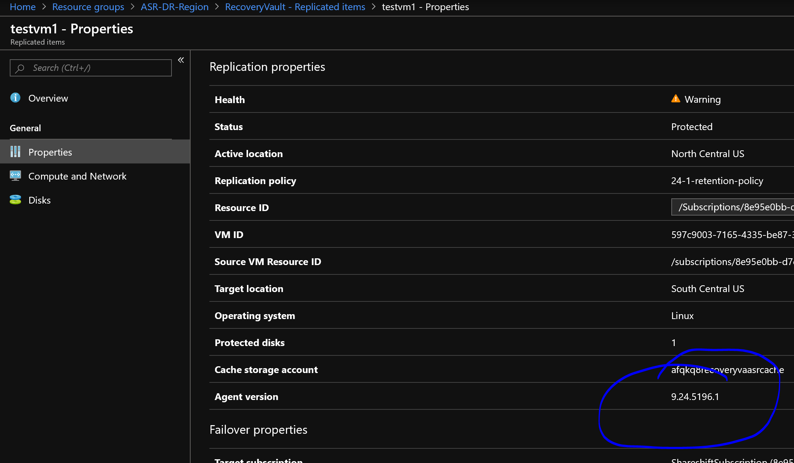

# Azure Site Recovery
## App-Consistent Recovery for Linux

The process to create the recovery pre and post scripts are below:

1. Use needs to create a script by name “customscript.sh” in the below location

```
/usr/local/ASR/Vx/scripts/customscript.sh
```

2. Before taking the application consistent snapshots, it will call “customscript.sh” with -- pre as parameter for “pre script”. After taking the snapshot, it will call with -- post as parameter for “post script”. Your logic of pausing the application should go into this file. The execution permissions of this file should be managed by the customer.
1. Any console output from “customscript.sh” is appended to this location so that customers can debug any script logic issues

```
/var/log/ApplicationPolicyLogs/customscript.log
```

4. Any failures in the script are ignored and ASR recovery point creation process will proceed as usual

Your Linux VM needs to be running agent version 24 or greater:



Here is a sample bash script for testing:

```
	#!/bin/bash
	
	if [ $# == 0 ]; then
	        echo "You must specify pre or post for script"
	else
	        if [ $1 == "pre" ]; then
	                echo "$1-processing script running at $(date '+%B %d, %Y %H:%M:%S' )" >> ~/pre-script-results.txt
	                echo "$1-processing script running at $(date '+%B %d, %Y %H:%M:%S' )"
	        fi
	        if [ $1 == "post" ]; then
	                echo "$1-processing script running at $(date '+%B %d, %Y %H:%M:%S' )" >> ~/post-script-results.txt
	                echo "$1-processing script running at $(date '+%B %d, %Y %H:%M:%S' )"
	        fi
	fi
	

```

You also need to open up outbout ports:


https://docs.microsoft.com/en-us/azure/site-recovery/azure-to-azure-about-networking#outbound-connectivity-for-ip-address-ranges
